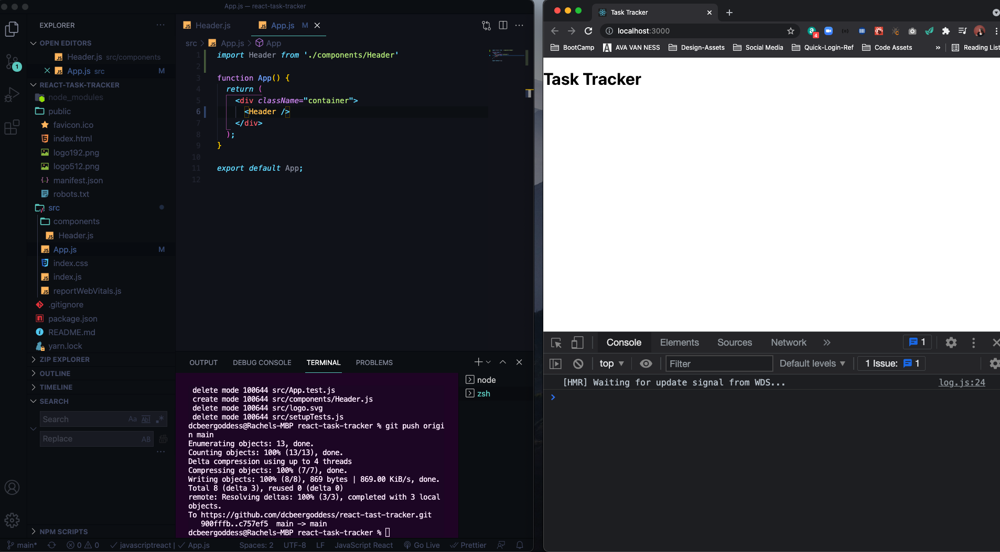
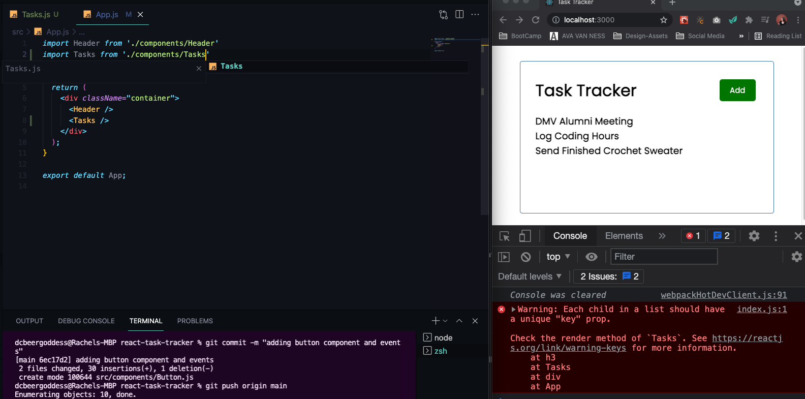
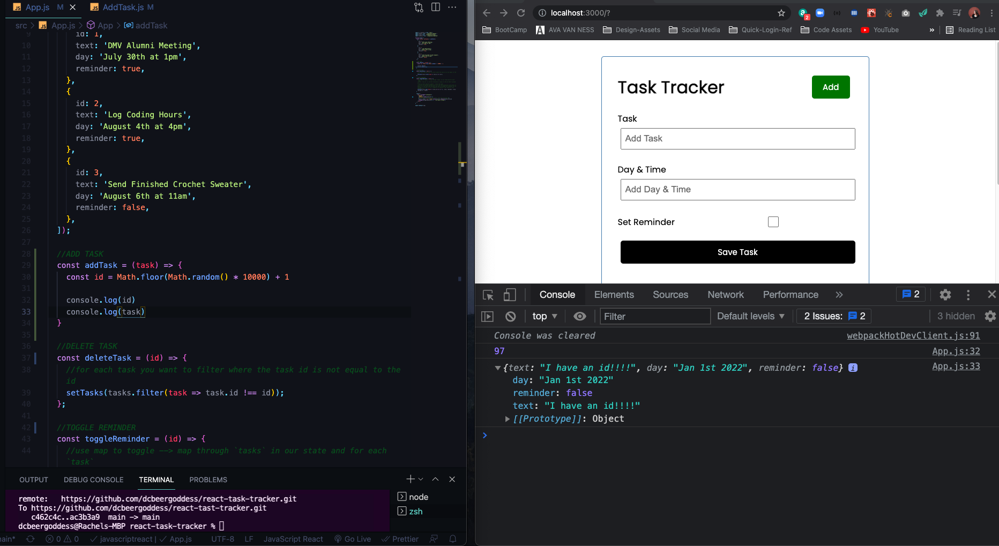

# React JS Crash Course 2021
Follow Along with [Traversy Media React Crash Course 2021](https://www.youtube.com/watch?v=w7ejDZ8SWv8)
[GITHUB REPO FROM BRAD](https://github.com/bradtraversy/react-crash-2021)

## What is React?
* React is a library for building user interfaces
* React runs on the client as a SPA(Single Page App), but can be used to build full stack apps by communicating with a server/API (eg. MERN stack)
* React is often refereed to as a front-ent "framework" because it is capable and directly comparable to a framework such as Angular or Vue

## Why Would You Use React

* MVC (Model View Controller) --> Structure the "view" layer of your application
* Reusable components with their own state
* JSX - Dynamic markup --> write dynamic HTML (JS formatted like HTML)
* Interactive UIs with Virtual DOM --> Document Object Model --> Update parts of page without reloading it
* Performance & Testing --> All Data immutable (can't mutate directly), easier to work on teams
* Very Popular in the Industry

## UI Components
* When using React, think of your UI as a bunch of separate components

## Components: Functions vs. Classes

* Focus on Functions with Hooks
* JSX (JavaScript Syntax Extension) - syntactic sugar
* Can pass in "props" --> essentially attributes

## Working with State
* Components can have "state" which is an object that determines how a component renders and behaves (ex: collapsible menu, list of tasks, any data you bring into your compnents)
* **"App"** or **"global"** state refers to state that is available to the entire UI, not just a single component (share data with multiple components when global state gets complicated --> Redux (3rd Party Manager) or Context API)
* Prior to React 16.8, we had to use class based components to use state. Now we can use functional component with **HOOKS** (functional components used to be dumb components)

## React Hooks
React Hooks are functions that le us hook into the React state and lifecyle features from function components
- `useState` --> Returns a stateful value and a function to update it
- `useEffect` --> Perform side effects in function components --> when making HTTP requests
- `useContext`, `useReducer`, `useRef` --> Beyond the scope of this course
- You can also create your own Custom Hooks

## Create a New React App
* [Documentation](https://reactjs.org/docs/create-a-new-react-app.html)
* [React Developer Tools Chrome Extension](https://chrome.google.com/webstore/detail/react-developer-tools/fmkadmapgofadopljbjfkapdkoienihi?hl=en)
* To start up new Application

```js
  npx create-react-app my-app
  cd my-app
  npm start
```
* [MY GITHUB REPO OF REACT TASK TRACKER APP](https://github.com/dcbeergoddess/react-tast-tracker)
* Here's a look at what you get, in the package.json you have some dependencies --> if in react native you would see `react-native` instead of `react-dom`

* Look of the index.js and index.html --> `App` is the Route Component (every component we create will end up in main App component)

* Use index.html to add Bootstrap CDN, etc.
* In `App.js` --> we see function component with JSX(looks like HTML)

- instead of `for` attribute use `htmlFor`
- instead of `class` attribute use `className`
- dynamic --> can have JS expressions and variables `src={logo}`
- Clean up some files and delete what is in the div
- CAN ONLY HAVE ONE PARENT ELEMENT, CAN NOT ADD NEW H2 AFTER THE DIV

- if you didn't want a div inside a div you can use fragments `<>` to surround the two headers. 

- You can create variables, ternary operators, ect. and use with JSX


## CREATE COMPONENTS
* GREAT VS CODE EXTENSION
```js
Name: ES7 React/Redux/GraphQL/React-Native snippets
Id: dsznajder.es7-react-js-snippets
Description: Simple extensions for React, Redux and Graphql in JS/TS with ES7 syntax
Version: 3.1.1
Publisher: dsznajder
VS Marketplace Link: https://marketplace.visualstudio.com/items?itemName=dsznajder.es7-react-js-snippets
```
- `rcc` - class based component
- `rce` - class component and export at bottom
- `rafce` - arrow function that exports at bottom
* Creates boilerplate of a function component --> DO NOT NEED IMPORT REACT ANYMORE (unless you are creating a class)
* use `_rafce` to skip import addition

```js
//EXAMPLE OF USING A CLASS
import React, { Component } from 'react'

export class Header extends Component {
  render() {
    return (
      <div>
        
      </div>
    )
  }
}

export default Header
```
* import component into `App.js`

```js
//EXAMPLE OF IMPORTING A CLASS
import React from 'react'
import Header from './components/Header'

class App extends React.Component {
  render() {
    return <h1>Hello from a class</h1>
  }
} 
```

## Pass in Component `Props`
* How to pass in props and use them

* can set default props if none is passed in

* can destructure props 

* There are also Prop Types --> make code more robust --> use `impt` with extension --> you can also use Typescript with React
* Use and pass in number instead of string for title, will render with warnings in the console

* Set `PropType` to be required


## Styling 
1. Can use stylesheet 
2. external package --> style components
3. direct or inline css in JavaScript

* Inline CSS Styling in JavaScript using two brackets - `{{}}`

* Direct CSS on component --> will use for dynamic styling


* Using Style sheet 
* [Code from Traversy Media's Github](https://github.com/bradtraversy/react-crash-2021/blob/master/src/index.css)

* add `classNames` to components from stylesheet, added button on Header Component


## Make Button Component
* Make Button Component with props, example of reusable components

* adding defaults and PropTypes to button


## EVENTS
* Intro to setting Events --> 'onClick'

* you can pass in event object to onClick and access position of button along with other properties

* use `onClick` event as a `prop` since Button is a Component


## State and Tasks
* Created Array of dummy data for tasks --> loop through information to output creating a list using the map array method
1. in `Tasks.js`
```js
  const Tasks = () => {
  return (
    <>
     {tasks.map((task) => (
        <h3>{task.text}</h3> //JSX
      ))} 
    </>
  )
}
```
2. in `App.js`

3. Get warning about key props, parent element (the `h3`) need to have a key prop --> needs to be unique
```js
const Tasks = () => {
  return (
    <>
     {tasks.map((task) => (
        <h3 key={task.id}>{task.text}</h3>
      ))} 
    </>
  )
}
```
4. We don't want the array of tasks to be a separate from our component, we want it to be part of our state  --> we are going to use the `useState` hook to use state inside of a function. Above the return: what you want to call this piece of state, `tasks`, and function to update state, `setTasks`, --> set that to `useState` and paste in default you want to use (in this case the array of tasks)
```js
const Tasks = () => {
  const [tasks, setTasks] = useState([
      {
        id: 1,
        text: 'DMV Alumni Meeting',
        day: 'July 30th at 1pm',
        reminder: true,
      },
      {
        id: 2,
        text: 'Log Coding Hours',
        day: 'August 4th at 4pm',
        reminder: true,
      },
      {
        id: 3,
        text: 'Send Finished Crochet Sweater',
        day: 'August 6th at 11am',
        reminder: false,
      }
    
  ])
  return (
    <>
     {tasks.map((task) => (
        <h3 key={task.id}>{task.text}</h3>
      ))} 
    </>
  )
}
```
- State is immutable, can't directly change, so you can't use  `tasks.push()` to add new tasks, if you want to change any part of the state you use `setTasks`, you recreate it and send it down
```js
  //if you want to spread across what is already there and add a new object
  setTasks([...tasks, {}])
```
- Normally you wouldn't have the tasks in the Task component cause we're going to want to access these from other components, use `Redux` or the `Context API`, have a store that hovers over your UI that you can pull different pieces of state from
- We are going to put it in the `App.js` before the `return` and make it our `global state` and pass it down to our components as `props`
```js
//PASS IT INTO TASK COMPONENT IN APP.JS as PROPS
  return (
    <div className="container">
      <Header />
      <Tasks tasks={tasks} />
    </div>
  );

//PASS IT INTO THE TASKS.JS DESTRUCTURE AS PROPS
const Tasks = ({ tasks }) => {
  return (
    <>
     {tasks.map((task) => (
        <h3 key={task.id}>{task.text}</h3>
      ))} 
    </>
  )
}
```

## Create New Task Component
- Test by Creating a new `Task.js` component with generic h3 that will get outputted for every task for now

- use the task prop you added in `Tasks.js`


## ADD Delete Icon and Delete Function Prop 
- use font awesome for delete icon and add the CDN into your index.html or install `react icons`
1. `npm i react-icons` --> access to multiple libraries
2. bring in specific icon FaTimes is the 'x' icon from 'fa' or fontawesome --> `import { FaTimes } from 'react-icons/fa'`

3. Add style to icon

* Using the icon to delete specific task --> with context API or Redux there are ways to access state from within components pretty easily can get complicated with redux and reducers, etc. In this case we can just use props and send down a function as a prop and fire that off when we click on task
1. In `App.js`
```js
//DELETE TASK
const deleteTask = (id) => {
  console.log('delete', id);
}

  return (
    <div className="container">
      <Header />
      <Tasks tasks={tasks} onDelete={deleteTask} />
    </div>
  );
}
```
2. Pass prop `onDelete` into `Task.js` and `Tasks.js` --> log of `id` defaults to event info

3. use in `Task.js` as function instead for `onClick`

4. use `setState` instead of console.log
```js
//DELETE TASK
const deleteTask = (id) => {
  //for each task you want to filter where the task id is not equal to the id
  setTasks(tasks.filter((task) => task.id !== id))
}
```
5. set default message for when there are no tasks
```js
  return (
    <div className="container">
      <Header />
      {/* IF THERE ARE TASKS, show Tasks, else show message */}
      {tasks.length > 0 ? <Tasks tasks={tasks} onDelete={deleteTask} /> : 'No Tasks To Show'}
    </div>
  );
```
- They will come back when page refreshes since this is the UI and that is what react does, you can turn into full stack app by having back end and have some kind of API you can make requests to and fetch data from --> will try out at end with `JSON Server`

## Add Reminder
* Want to double click and have a class (in css under `.task.reminder`) that will change the task to the opposite of whatever is set and if it is true have  border
1. add a reminder toggle in `App.js`, and pass prop into `Tasks`
```js
//Toggle Reminder
  const toggleReminder = (id) => {
    console.log(id);
  }

  return (
    <div className="container">
      <Header />
      {/* IF THERE ARE TASKS, show Tasks, else show message */}
      {tasks.length > 0 ? <Tasks tasks={tasks} onDelete={deleteTask} onToggle={toggleReminder} /> : 'No Tasks To Show'}
    </div>
  );
```
2. catch the prop in `Tasks.js`, pass into `Task` and then add to main div in `Task.js` 

3. now we want to add logic to toggle reminder from true to false or false to true --> many ways to do this, we are going to use map
```js
   //Toggle Reminder
  const toggleReminder = (id) => {
    //use map to toggle --> map through `tasks` in our state and for each `task` 
    //where `task.id` in current iteration is equal to the id that's passed in 
    //then we have specific object (else the task) 
    //we want to copy && spread across all the task properties and values (of the task that matches) but want to change the reminder so the reminder i'm going to set is opposite of whatever that specific task reminder is
    setTasks(tasks.map((task) => task.id === id ? {...task, reminder: !task.reminder } : task))
  }
```
4. Using React Dev Tools --> go to Components

* now we can see our component tree --> look on App in Tree and check out State

* double click on first task and the state changes

5. Nothing in UI that lets us know that the state has changed yet, use class of reminder in `Task.js` to add a border to the edge
* On `className` make it into an expression and still want the class `task` (that will be there no matter what), but add a condition in a template literal, if `task.reminder` is true then we're going to have the class of `reminder`, else nothing.
```js
    <div className={`task ${task.reminder ? 'reminder' : ''}`} onDoubleClick={() => onToggle(task.id)}>
      <h3>
        {task.text} 
        <FaTimes 
        style={{color: 'red', cursor: 'pointer'}}
        onClick={() => onDelete(task.id)} 
        />
      </h3>
      <p>{task.day}</p>
    </div>
```

* still goes back to default after refresh because we are just using static data, if we had a back end you'd be making `fetch` or `http` requests to your server as well.

## ADD Form
1. Create `AddTask.js` in Components --> Simple Form to Display for now
```js
  const AddTask = () => {
  return (
    <form className='add-form'>
      <div className='form-control'>
        <label>Task</label>
        <input type='text' placeholder='Add Task' />
      </div>
      <div className='form-control'>
        <label>Day & Time</label>
        <input type='text' placeholder='Add Day & Time' />
      </div>
      <div className='form-control'>
        <label>Set Reminder</label>
        <input type='checkbox'/>
      </div>

      <input type='submit' value='Save Task' />
    </form>
  )
}

export default AddTask
```
2. Add to `App.js` and add some styling on the form from imported CSS by Traversy Media


## Form Input State
1. each input it going to have it's own piece of **component level state** NOT **app level state**, bring in `useState` and set up for each input with defaults (reminder = false, text and day = '')
```js
import { useState } from 'react'

const AddTask = () => {
  const [text, setText] = useState('')
  const [day, setDay] = useState('')
  const [reminder, setReminder] = useState(false)
```
2. In `input` for text, the `value` of text is going to be the text from the state but we also need an `onChange` because when you start to type in the input that's going ot fire off this on change, it's a controlled component, going to have function where we pass in the event object and directly call setText from here and set it to `e.target.value` which will be whatever is typed in, same for `day` and `setDay`
```js
      <div className='form-control'>
        <label>Task</label>
        <input 
          type='text' 
          placeholder='Add Task' 
          value={text}
          onChange={(e) => setText(e.target.value)}
        />
```
* for the checkbox use `currentTarget.checked` --> give us either a true or false value if that is checked or not
* Look in React-Dev-Tools under AddTask as we can see the state

* you can add in input text an state changes, hit save task and page back to default state right now

4. in `App.js` add logic for ADD TASK --> it will take in task, and console.log task for now
```js
  //ADD TASK
  const addTask = (task) => {
    console.log(task)
  }
```
5. pass it into as prop on AddTask
```js
  return (
    <div className="container">
      <Header />
      <AddTask onAdd={addTask} />
      {/* IF THERE ARE TASKS, show Tasks, else show message */}
      {tasks.length > 0 ? <Tasks tasks={tasks} onDelete={deleteTask} onToggle={toggleReminder} /> : 'No Tasks To Show'}
    </div>
  );
```
6. in `AddTask.js` component we want to take in `onAdd` and add `onSubmit` event to form and set that to `onSubmit`
*define onSubmit above return statement, we are not calling onAdd directly
* onSubmit will take in the `event object`, we need `e.preventDefault()` so it does not submit to a page
* add validation for the task text --> if text is not there, do an alert --> if that passed then we are going to call `onAdd` and pass in an object with the text, day and reminder
* then you also want to clear the form so call default state again
```js
  const onSubmit = (e) => {
    e.preventDefault()

    if (!text) {
      alert('Please Add a Task')
      return
    }

    onAdd({ text, day, reminder })

    setText('')
    setDay('')
    setReminder(false)
  }
```
* on checkbox reminder, set checked to reminder
```js
      <div className='form-control form-control-check'>
        <label>Set Reminder</label>
        <input 
          type='checkbox'
          checked={reminder}
          value={reminder}
          onChange={(e) => setReminder(e.currentTarget.checked)}
        />
```
* Test adding tasks and look in console

6. Instead of console logging we want to add this to our state so in order to do that --> there are a bunch of ways --> since we are not dealing with a back end that creates an id we'll want to add an id to `addTask` function --> generate random number for id
```js
 //ADD TASK
  const addTask = (task) => {
    const id = Math.floor(Math.random() * 10000) + 1

    console.log(id)
    console.log(task)
  }
```

7. Now we will create new task and add id, plus copy the task text, day and reminder and add to object as well.
* setTasks as array, copy tasks already there and add new task onto it
```js
  //ADD TASK
  const addTask = (task) => {
    const id = Math.floor(Math.random() * 10000) + 1
    const newTask = {id, ...task}
    setTasks([...tasks, newTask])
  }
```


## Use Add Button to Toggle Add Form
1. Add new piece of state in the `App.js` for `showAddTask` and set to false as default
```js
function App() {
  const [showAddTask, setShowAddTask] = useState(false)
  const [tasks, setTasks] = useState([
```
2. embed in in AddTask, wrap in curly braces and say if `showAddTask` is `true` then show that component, shorter way of doing a ternary without an else, we just want ot see if it's true, is so do this, if not we do nothing.
```js
  return (
    <div className="container">
      <Header />
      {showAddTask && <AddTask onAdd={addTask} />}
      {/* IF THERE ARE TASKS, show Tasks, else show message */}
      {tasks.length > 0 ? <Tasks tasks={tasks} onDelete={deleteTask} onToggle={toggleReminder} /> : 'No Tasks To Show'}
    </div>
  ); 
```
3. Use button to toggle state, we need to do a few things
* Button is inside the `Header` --> add prop `onAdd` and add function to setShowAddTask and we want to set it to whatever the opposite is of the current state 
```js
  return (
    <div className="container">
      <Header onAdd={() => setShowAddTask(!showAddTask)} />
      {/* If showAddTask is true we show AddTask else we do nothing */}
      {showAddTask && <AddTask onAdd={addTask} />}
      {/* IF THERE ARE TASKS, show Tasks, else show message */}
      {tasks.length > 0 ? <Tasks tasks={tasks} onDelete={deleteTask} onToggle={toggleReminder} /> : 'No Tasks To Show'}
    </div>
  );
```
* Pass into `Header.js` as prop and change `onClick` to `onAdd` and button now toggles the form
```js
const Header = ({ title, onAdd }) => {
  return (
    <header className='header'>
      <h1>{title}</h1>
      <Button color='green' text='Add' onClick={onAdd} />
    </header>
  )
}
```
4. Update button style based on state
* in `App.js`, in addition to onAdd prop, pass in whatever the value of showAddTask is
```js
  return (
    <div className="container">
      <Header 
        onAdd={() => setShowAddTask(!showAddTask)}
        showAdd={showAddTask} 
      />
```
* back in `Header.js`, pass in `showAdd` prop and it will be either true or false if it is being shown or not
* change button text to be dynamic, if showAdd is true then we want to show 'close' else we show 'add', do same for color
```js
  return (
    <header className='header'>
      <h1>{title}</h1>
      <Button 
        color={showAdd ? 'red' : 'green'}  
        text={showAdd ? 'Close' : 'Add'} 
        onClick={onAdd} 
      />
    </header>
  )
```
* this is where react is valuable because it allows you to create really dynamic interfaces and no pages are being reloaded or anything like that
* Vanilla javascript is just very messy and unorganized and much more difficult
