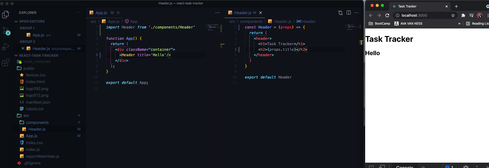
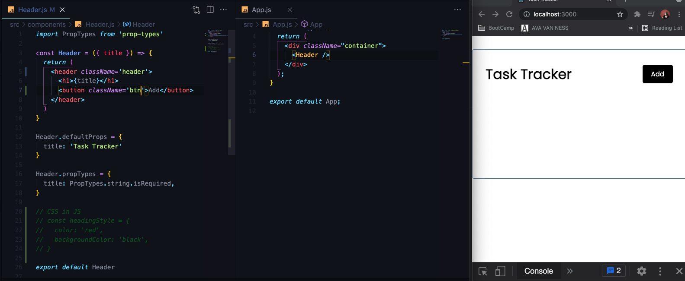
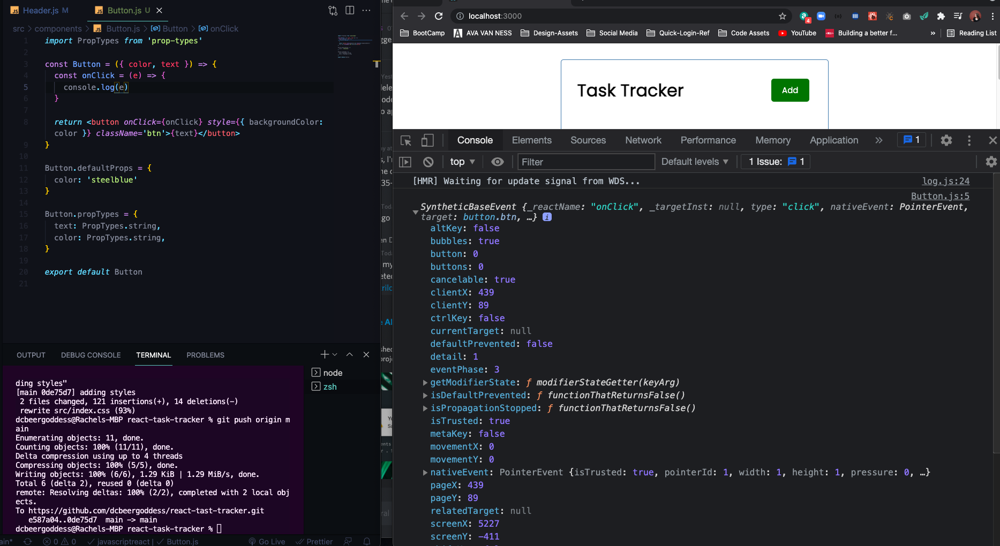

# React JS Crash Course 2021
Follow Along with [Traversy Media React Crash Course 2021](https://www.youtube.com/watch?v=w7ejDZ8SWv8)
[GITHUB REPO FROM BRAD](https://github.com/bradtraversy/react-crash-2021)

## What is React?
* React is a library for building user interfaces
* React runs on the client as a SPA(Single Page App), but can be used to build full stack apps by communicating with a server/API (eg. MERN stack)
* React is often refereed to as a front-ent "framework" because it is capable and directly comparable to a framework such as Angular or Vue

## Why Would You Use React

* MVC (Model View Controller) --> Structure the "view" layer of your application
* Reusable components with their own state
* JSX - Dynamic markup --> write dynamic HTML (JS formatted like HTML)
* Interactive UIs with Virtual DOM --> Document Object Model --> Update parts of page without reloading it
* Performance & Testing --> All Data immutable (can't mutate directly), easier to work on teams
* Very Popular in the Industry

## UI Components
* When using React, think of your UI as a bunch of separate components

## Components: Functions vs. Classes

* Focus on Functions with Hooks
* JSX (JavaScript Syntax Extension) - syntactic sugar
* Can pass in "props" --> essentially attributes

## Working with State
* Components can have "state" which is an object that determines how a component renders and behaves (ex: collapsible menu, list of tasks, any data you bring into your compnents)
* **"App"** or **"global"** state refers to state that is available to the entire UI, not just a single component (share data with multiple components when global state gets complicated --> Redux (3rd Party Manager) or Context API)
* Prior to React 16.8, we had to use class based components to use state. Now we can use functional component with **HOOKS** (functional components used to be dumb components)

## React Hooks
React Hooks are functions that le us hook into the React state and lifecyle features from function components
- `useState` --> Returns a stateful value and a function to update it
- `useEffect` --> Perform side effects in function components --> when making HTTP requests
- `useContext`, `useReducer`, `useRef` --> Beyond the scope of this course
- You can also create your own Custom Hooks

## Create a New React App
* [Documentation](https://reactjs.org/docs/create-a-new-react-app.html)
* [React Developer Tools Chrome Extension](https://chrome.google.com/webstore/detail/react-developer-tools/fmkadmapgofadopljbjfkapdkoienihi?hl=en)
* To start up new Application

```js
  npx create-react-app my-app
  cd my-app
  npm start
```
* [MY GITHUB REPO OF REACT TASK TRACKER APP](https://github.com/dcbeergoddess/react-tast-tracker)
* Here's a look at what you get, in the package.json you have some dependencies --> if in react native you would see `react-native` instead of `react-dom`

* Look of the index.js and index.html --> `App` is the Route Component (every component we create will end up in main App component)

* Use index.html to add Bootstrap CDN, etc.
* In `App.js` --> we see function component with JSX(looks like HTML)

- instead of `for` attribute use `htmlFor`
- instead of `class` attribute use `className`
- dynamic --> can have JS expressions and variables `src={logo}`
- Clean up some files and delete what is in the div
- CAN ONLY HAVE ONE PARENT ELEMENT, CAN NOT ADD NEW H2 AFTER THE DIV

- if you didn't want a div inside a div you can use fragments `<>` to surround the two headers. 

- You can create variables, ternary operators, ect. and use with JSX


## CREATE COMPONENTS
* GREAT VS CODE EXTENSION
```js
Name: ES7 React/Redux/GraphQL/React-Native snippets
Id: dsznajder.es7-react-js-snippets
Description: Simple extensions for React, Redux and Graphql in JS/TS with ES7 syntax
Version: 3.1.1
Publisher: dsznajder
VS Marketplace Link: https://marketplace.visualstudio.com/items?itemName=dsznajder.es7-react-js-snippets
```
- `rcc` - class based component
- `rce` - class component and export at bottom
- `rafce` - arrow function that exports at bottom
* Creates boilerplate of a function component --> DO NOT NEED IMPORT REACT ANYMORE (unless you are creating a class)
* use `_rafce` to skip import addition

```js
//EXAMPLE OF USING A CLASS
import React, { Component } from 'react'

export class Header extends Component {
  render() {
    return (
      <div>
        
      </div>
    )
  }
}

export default Header
```
* import component into `App.js`

```js
//EXAMPLE OF IMPORTING A CLASS
import React from 'react'
import Header from './components/Header'

class App extends React.Component {
  render() {
    return <h1>Hello from a class</h1>
  }
} 
```

## Pass in Component `Props`
* How to pass in props and use them

* can set default props if none is passed in

* can destructure props 

* There are also Prop Types --> make code more robust --> use `impt` with extension --> you can also use Typescript with React
* Use and pass in number instead of string for title, will render with warnings in the console

* Set `PropType` to be required


## Styling 
1. Can use stylesheet 
2. external package --> style components
3. direct or inline css in JavaScript

* Inline CSS Styling in JavaScript using two brackets - `{{}}`

* Direct CSS on component --> will use for dynamic styling


* Using Style sheet 
* [Code from Traversy Media's Github](https://github.com/bradtraversy/react-crash-2021/blob/master/src/index.css)

* add `classNames` to components from stylesheet, added button on Header Component


## Make Button Component
* Make Button Component with props, example of reusable components

* adding defaults and PropTypes to button


## EVENTS
* Intro to setting Events --> 'onClick'

* you can pass in event object to onClick and access position of button along with other properties

* use `onClick` event as a `prop` since Button is a Component


## State and Tasks
* Created Array of dummy data for tasks --> loop through information to output creating a list using the map array method
1. in `Tasks.js`
```js
  const Tasks = () => {
  return (
    <>
     {tasks.map((task) => (
        <h3>{task.text}</h3> //JSX
      ))} 
    </>
  )
}
```
2. in `App.js`

3. Get warning about key props, parent element (the `h3`) need to have a key prop --> needs to be unique
```js
const Tasks = () => {
  return (
    <>
     {tasks.map((task) => (
        <h3 key={task.id}>{task.text}</h3>
      ))} 
    </>
  )
}
```
4. We don't want the array of tasks to be a separate from our component, we want it to be part of our state  --> we are going to use the `useState` hook to use state inside of a function. Above the return: what you want to call this piece of state, `tasks`, and function to update state, `setTasks`, --> set that to `useState` and paste in default you want to use (in this case the array of tasks)
```js
const Tasks = () => {
  const [tasks, setTasks] = useState([
      {
        id: 1,
        text: 'DMV Alumni Meeting',
        day: 'July 30th at 1pm',
        reminder: true,
      },
      {
        id: 2,
        text: 'Log Coding Hours',
        day: 'August 4th at 4pm',
        reminder: true,
      },
      {
        id: 3,
        text: 'Send Finished Crochet Sweater',
        day: 'August 6th at 11am',
        reminder: false,
      }
    
  ])
  return (
    <>
     {tasks.map((task) => (
        <h3 key={task.id}>{task.text}</h3>
      ))} 
    </>
  )
}
```
- State is immutable, can't directly change, so you can't use  `tasks.push()` to add new tasks, if you want to change any part of the state you use `setTasks`, you recreate it and send it down
```js
  //if you want to spread across what is already there and add a new object
  setTasks([...tasks, {}])
```
- Normally you wouldn't have the tasks in the Task component cause we're going to want to access these from other components, use `Redux` or the `Context API`, have a store that hovers over your UI that you can pull different pieces of state from
- We are going to put it in the `App.js` before the `return` and make it our `global state` and pass it down to our components as `props`
```js
//PASS IT INTO TASK COMPONENT IN APP.JS as PROPS
  return (
    <div className="container">
      <Header />
      <Tasks tasks={tasks} />
    </div>
  );

//PASS IT INTO THE TASKS.JS DESTRUCTURE AS PROPS
const Tasks = ({ tasks }) => {
  return (
    <>
     {tasks.map((task) => (
        <h3 key={task.id}>{task.text}</h3>
      ))} 
    </>
  )
}